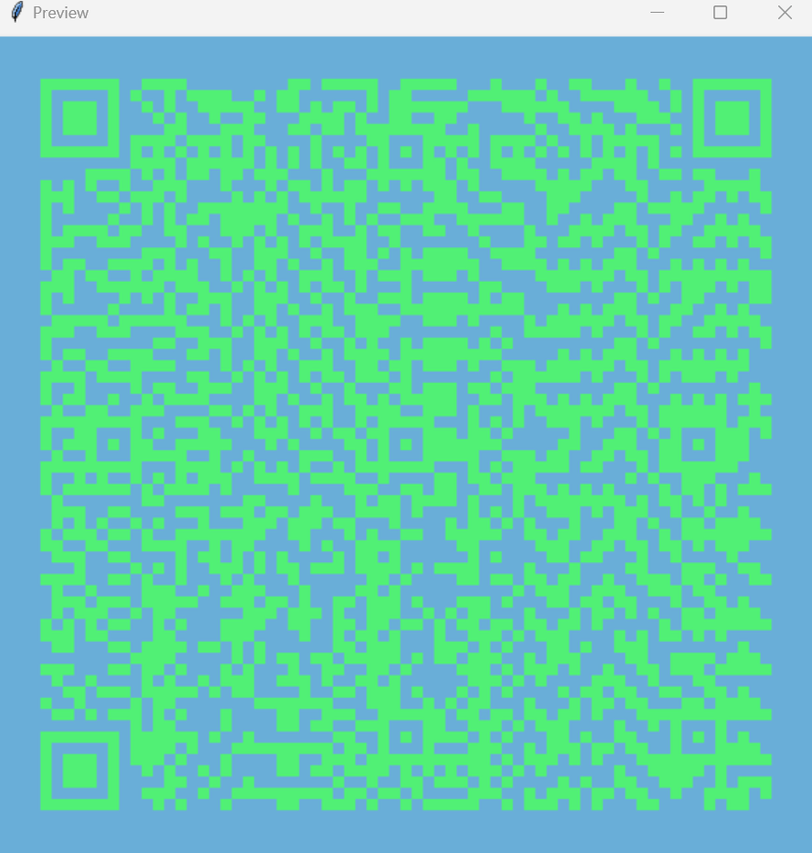
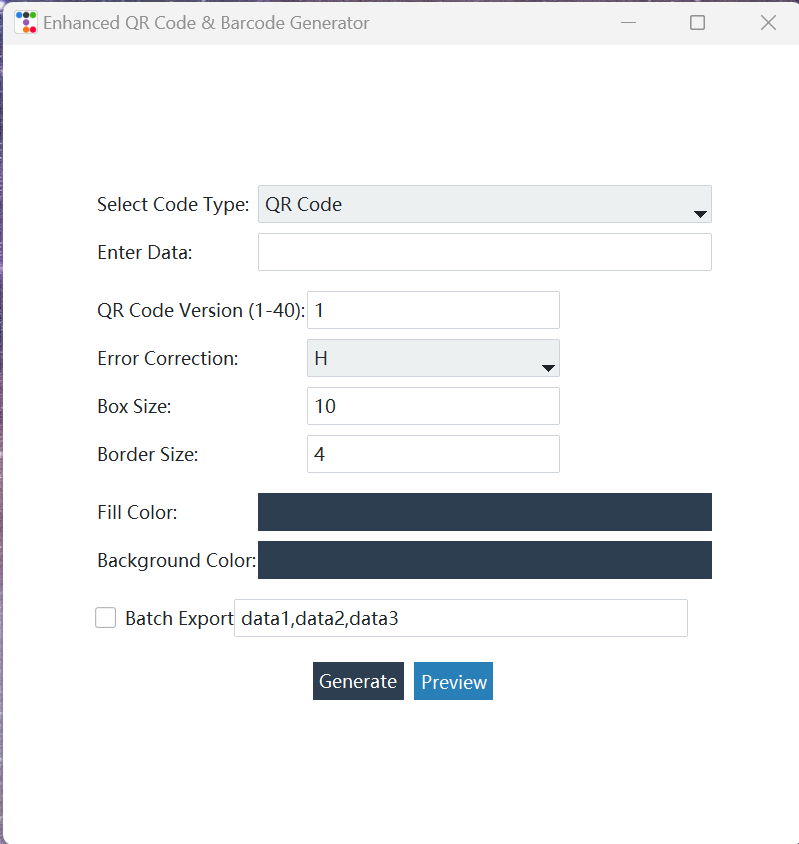

# Enhanced QR Code & Barcode Generator

## Table of Contents
- [Overview](#overview)
- [Features](#features)
- [Installation](#installation)
- [Requirements](#requirements)
- [Usage](#usage)
- [Screenshots](#screenshots)
- [Contribution](#contribution)
- [License](#license)
- [Acknowledgements](#acknowledgements)

## Overview
The Enhanced QR Code & Barcode Generator is a powerful and versatile application developed using Python and the Tkinter library. This tool allows users to generate a wide variety of barcodes and QR codes, customize their appearance with extensive options, preview them in real-time, and save them in multiple image formats. Supported formats include QR Code, EAN13, EAN8, Code128, Code39, UPCA, ISBN13, ISBN10, ISSN, PZN, JAN, ITF, GS1-128, DataMatrix, Aztec, and PDF417. This version offers significant improvements in customization and usability, making it an indispensable tool for anyone needing robust barcode and QR code solutions.
## Features

-   **QR Code Generation**: Create QR codes with customizable parameters such as versions (1-40), error correction levels (L, M, Q, H), box sizes, and border sizes. This ensures the generated QR codes meet the specific needs and constraints of different applications.
    
-   **Barcode Generation**: Generate an extensive range of barcodes including EAN13, EAN8, Code128, Code39, UPCA, ISBN13, ISBN10, ISSN, PZN, JAN, ITF, and GS1-128. Adjust parameters such as module width, module height, font size, and text distance to fine-tune the barcode appearance for various use cases.
    
-   **DataMatrix, Aztec, and PDF417 Codes**: Support for additional 2D barcode formats like DataMatrix, Aztec, and PDF417, expanding the range of encoding options available to users.
    
-   **Color Customization**: Choose custom fill and background colors for the generated codes, allowing for personalized and visually distinct barcodes and QR codes.
    
-   **Preview Functionality**: Preview the generated codes in a dedicated preview window before saving, ensuring the output meets the desired specifications and appearance.
    
-   **Save Options**: Save the generated codes in various formats including PNG, JPG, and SVG, providing flexibility in how the codes are used and shared.
    
-   **Error Handling and Validation**: Robust error handling and input validation ensure that the data entered for generating codes is correct and meets the required standards, preventing common mistakes and ensuring high-quality output.
    
-   **User-Friendly Interface**: The application features an intuitive and user-friendly interface with clear instructions and easy-to-navigate settings, making it accessible to both novice and experienced users.
    
-   **Customizable Settings**: Extensive customization options for both QR codes and barcodes, including detailed settings for module dimensions, text formatting, and error correction, ensuring that the generated codes are perfectly tailored to user needs.
## Installation
To run the Enhanced QR Code & Barcode Generator, you need to install the required dependencies. Follow these steps:

1. **Clone the repository**:
    ```bash
    git clone https://github.com/CARL-JOSEPH-LEE/qr-barcode-generator.git
    cd qr-barcode-generator
    ```
2. **Create a virtual environment**:
    ```bash
    python -m venv venv
    source venv/bin/activate  # On Windows: venv\Scripts\activate
    ```
3. **Install the dependencies**:
    ```bash
    pip install -r requirements.txt
    ``` 

## Requirements
- Python 3.7 or higher
- tkinter
- qrcode
- python-barcode
- pylibdmtx
- pillow
- pdf417gen
- pyqrcodeng

You can install the dependencies via `pip`:
```bash
pip install tkinter qrcode python-barcode pylibdmtx pillow pdf417gen pyqrcodeng
``` 
## Usage

To run the application, execute the following command in your terminal:

`python src/main.py` 

### User Interface

1.  **Select Code Type**: Choose the type of code you want to generate from the dropdown menu.
2.  **Enter Data**: Input the data you want to encode.
3.  **QR Code Settings** (if applicable):
    -   Version (1-40)
    -   Error Correction Level (L, M, Q, H)
    -   Box Size
    -   Border Size
4.  **Barcode Settings** (if applicable):
    -   Module Width
    -   Module Height
    -   Font Size
    -   Text Distance
5.  **Color Customization**:
    -   Fill Color
    -   Background Color
6.  **Generate or Preview**:
    -   Click "Generate" to save the code as an image file.
    -   Click "Preview" to see a preview of the code.

## Screenshots
Here's how the application looks:



## Contribution

Contributions are welcome! If you have suggestions for improvements or new features, feel free to create an issue or submit a pull request. 

## License

This project is licensed under the MIT License. See the LICENSE.txt for more details.

## Acknowledgements

-   The [qrcode](https://pypi.org/project/qrcode/) library for QR code generation.
-   The [python-barcode](https://pypi.org/project/python-barcode/) library for barcode generation.
-   The [pylibdmtx](https://pypi.org/project/pylibdmtx/) library for DataMatrix code generation.
-   The [Pillow](https://pypi.org/project/Pillow/) library for image processing.
-   The [pdf417gen](https://pypi.org/project/pdf417gen/) library for PDF417 code generation.
-   The [pyqrcodeng](https://pypi.org/project/pyqrcodeng/) library for Aztec code generation.